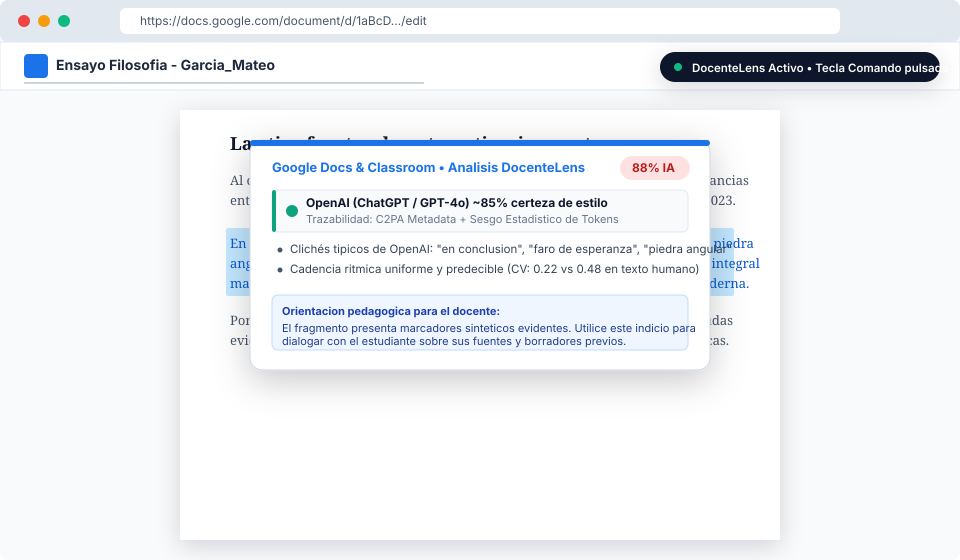
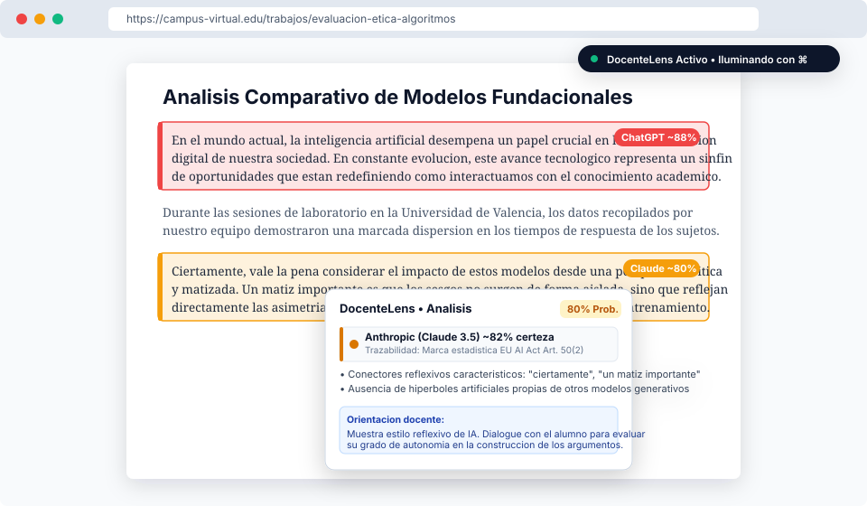
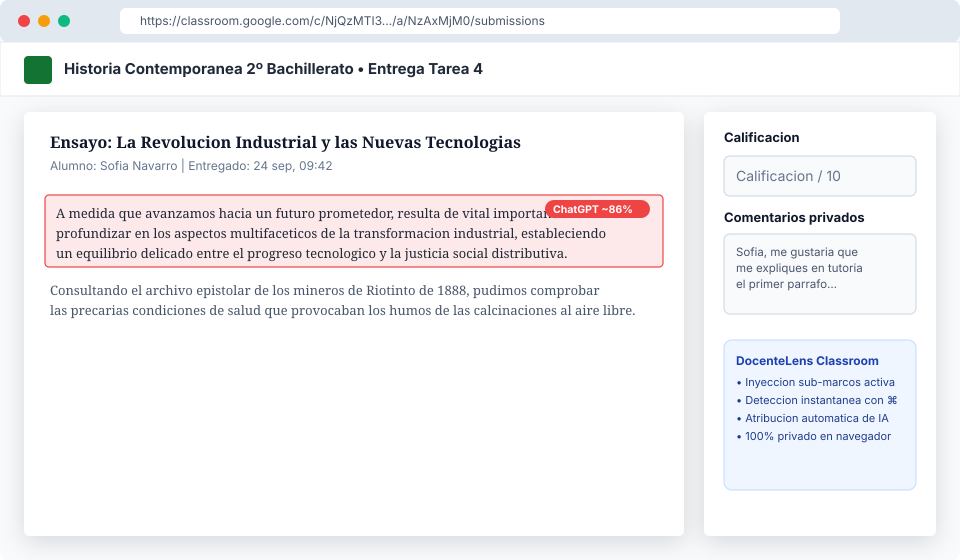

# DocenteLens

> **Detector y resaltador visual de contenido generado por IA en tiempo real para educadores.**  
> Herramienta gratuita, de codigo abierto, respetuosa con la privacidad del estudiante y diseñada especificamente para el ambito pedagogico.

---

## Descripcion General

DocenteLens es una extension para Google Chrome (Manifest V3) creada para que docentes, profesores y evaluadores academicos puedan identificar indicios de texto e imagenes generados mediante Inteligencia Artificial (OpenAI ChatGPT, Anthropic Claude, Google Gemini, Midjourney, DALL-E) de forma instantanea y no destructiva.

A diferencia de los detectores comerciales basados en sistemas cerrados que emiten porcentajes opacos sin explicacion:
1. **Activacion bajo demanda ("Press-to-Illuminate"):** Al mantener pulsada la tecla **Comando** (en Mac) o **Control** (en Windows/Linux), todas las secciones generadas o asistidas por IA se iluminan de inmediato en la pantalla con un indicador visual y metricas explicativas.
2. **Restauracion instantanea y limpia:** Al soltar la tecla, la pagina web o el documento vuelve de inmediato a su estado original sin alterar el diseño ni recargar el navegador.
3. **Ejecucion 100% Local y Privada:** No envia los trabajos de los alumnos a ningun servidor externo. Todo el procesamiento se realiza en el navegador del docente.
4. **Atribucion de Modelos y Explicabilidad:** Identifica que modelo de IA genero probablemente el texto y desglosa los factores analizados (cadencia ritmica de oraciones, densidad de conectores sinteticos y formulas rigidas) para fundamentar una conversacion formativa con el estudiante.

---

## Capturas de Uso Real de la Herramienta

### 1. Evaluacion de Trabajos en Google Docs

Inspeccion en tiempo real de parrafos dentro del editor de Google Docs mediante seleccion y pulsacion de la tecla Comando:



### 2. Iluminacion de Parrafos en Navegacion Web

Visualizacion de bloques sinteticos iluminados con insignias de modelo (ChatGPT, Claude, Gemini) y tarjeta de desglose metrico:



### 3. Calificacion de Entregas en Google Classroom

Integracion en el panel de calificacion de Google Classroom con ejecucion directa en los marcos de previsualizacion de tareas:



---

## Integracion Nativa con Google Classroom y Google Docs

DocenteLens ha sido diseñada teniendo en cuenta los flujos reales de correccion docente en el ecosistema de Google Workspace:

### Google Classroom (classroom.google.com)
- Opera en rubricas, comentarios privados, respuestas textuales directas de alumnos y paneles de calificacion.
- Gracias a la configuracion de inyeccion en todos los marcos (`all_frames: true`), se activa automaticamente dentro de los marcos y visores de tareas entregadas por los alumnos.

### Google Docs (docs.google.com)
- Dado que Google Docs utiliza un motor de renderizado basado en lienzo (`canvas`), DocenteLens incorpora un controlador especializado:
  - **Enlace de eventos de cursor (`docs-texteventtarget`):** Captura la pulsacion de la tecla Comando incluso cuando el cursor de edicion se encuentra activo dentro del documento.
  - **Analisis por Seleccion o Documento Completo:** Seleccione cualquier parrafo con el raton o pulse `Cmd + A` para seleccionar todo el texto y mantenga presionada la tecla Comando.
  - **Tarjeta Flotante de Inspeccion:** Despliega una tarjeta superior con el nivel de probabilidad, el modelo de IA atribuido y las recomendaciones formativas para la tutoria.

---

## Modos de Activacion

El docente puede configurar el disparador de activacion desde el menu de la extension:

| Disparador | Recomendado para | Descripcion |
| :--- | :--- | :--- |
| **Tecla Comando (Cmd)** *(Por defecto)* | **Mac (Teclado)** | Mantenga pulsada la tecla Comando para iluminar al instante el contenido IA. |
| **Tecla Control (Ctrl)** | **Windows / Linux** | Mantenga pulsada la tecla Control para activar la iluminacion. |
| **Alt / Option + Clic** | **Trackpads** | Mantenga pulsada la tecla Alt y haga clic sostenido sobre la pagina. |
| **Boton Central (Rueda)** | **Ratones convencionales** | Mantenga pulsada la rueda del raton hacia abajo para activar la lente. |
| **Clic Derecho sostenido** | **Navegacion con raton** | Mantenga pulsado el boton derecho (suprime el menu contextual durante la inspeccion). |
| **Fijar Resaltado (Pin)** | **Revision continua** | Mantiene la iluminacion activa de forma permanente en la pestaña. |

---

## Motor de Deteccion y Atribucion de Modelos

### 1. Analisis de Texto
- **Varianza Ritmica (Burstiness):** Los textos humanos combinan oraciones breves con construcciones complejas (alto coeficiente de variacion, CV > 0.45). Los modelos de lenguaje artificial producen cadencias regulares y uniformes (CV < 0.28).
- **Densidad de Marcadores Sinteticos:** Deteccion ponderada de conectores retoricos sobrerrepresentados en espanol e ingles (*"en conclusion"*, *"un tapiz de"*, *"desempeña un papel crucial"*, *"a medida que avanzamos"*, *"delve into"*, *"a testament to"*).
- **Diversidad Lexica (Type-Token Ratio):** Medicion de la riqueza y dispersion de vocabulario.
- **Estructuras Formulaicas:** Reconocimiento de esquemas de redaccion rigidos (introducciones tipicas, listas estructuradas con encabezados en negrita).

### 2. Atribucion de Modelos y Trazabilidad
DocenteLens identifica patrones estilisticos propios del entrenamiento por refuerzo (RLHF) de cada desarrollador:
- **OpenAI (ChatGPT / GPT-4o):** Deteccion de hiperboles sinteticas clasicas (*"faro de esperanza"*, *"piedra angular"*, *"hito significativo"*), formato de listas estructuradas y compatibilidad con metadatos C2PA de DALL-E 3.
- **Anthropic (Claude 3 / 3.5):** Identificacion de giros reflexivos y conectores de matiz (*"ciertamente"*, *"vale la pena considerar"*, *"desde una perspectiva"*, *"un matiz importante"*), ausencia de clichés genericos de ChatGPT y seguimiento de marcas estadisticas alineadas con el EU AI Act (Art. 50(2)).
- **Google (Gemini / Gemma):** Reconocimiento de sintesis ejecutivas (*"en pocas palabras"*, *"puntos clave a tener en cuenta"*), alineado con la tecnologia SynthID-Text de Google DeepMind.

### 3. Deteccion en Imagenes
- **Metadatos C2PA y Credenciales de Contenido:** Rastreo de firmas digitales de procedencia (C2PA, SynthID, OpenAI, Midjourney, Adobe Firefly).
- **Servidores de Origen:** Identificacion de URLs procedentes de servicios de generacion sintetica.
- **Geometria de Exportacion:** Deteccion de cuadriculas nativas caracteristicas (1024x1024 px, 512x512 px) carentes de perfiles EXIF fotográficos tradicionales.

---

## Marcas de Agua e Identificadores por Compañia

DocenteLens incluye referencias a los estandares de trazabilidad de los principales laboratorios de IA:

- **Google DeepMind (SynthID):** Incorpora un algoritmo que aplica una funcion pseudo-aleatoria (g-function) durante el muestreo de tokens en modelos de texto y marcas imperceptibles en los pixeles de Imagen 3.
- **OpenAI (C2PA + Muestreo de Tokens):** Integra credenciales criptograficas de procedencia C2PA en DALL-E 3 y sesgo estadistico en la seleccion de tokens para texto.
- **Anthropic (Marcas EU AI Act + C2PA):** Aplica marcas estadisticas invisibles para cumplir con los requerimientos de transparencia de la normativa europea y firmas C2PA en archivos visuales.

---

## Instalacion en Google Chrome

1. Descargue o clone este repositorio en su ordenador:
   ```bash
   git clone https://github.com/vTanco/Chrome_AI_detector.git
   ```
2. Abra Google Chrome y navegue a la direccion:
   ```
   chrome://extensions/
   ```
3. En la esquina superior derecha, active la casilla **Modo de desarrollador**.
4. Haga clic en el boton **Cargar descomprimida**.
5. Seleccione la carpeta del repositorio (`docente-ai-lens` o `Chrome_AI_detector`).
6. Si desea evaluar archivos locales (`file:///...`), haga clic en **Detalles** dentro de la tarjeta de la extension y active **Permitir acceso a URLs de archivo**.

---

## Entorno de Pruebas

El repositorio incluye un archivo de prueba con textos autenticos de estudiantes frente a textos generados por ChatGPT, Claude y Gemini:

1. Abra el archivo `test/sample_page.html` en Chrome.
2. Mantenga pulsada la tecla **Comando** (en Mac) o **Control** (en Windows/Linux).
3. Observe como los parrafos sinteticos se iluminan en tiempo real y sitúe el cursor sobre ellos para examinar la atribucion de modelo y los factores linguisticos.

---

## Compromiso Etico para Educadores

Ningun algoritmo de deteccion de IA es infalible. Las herramientas probabilisticas pueden arrojar falsos positivos, en particular con estudiantes que emplean estilos de redaccion muy academicos, estructurados o que no son hablantes nativos.

DocenteLens esta concebida como un instrumento de apoyo y orientacion formativa para abrir un dialogo constructivo con el alumnado, y nunca debe utilizarse como prueba concluyente para sancionar a un estudiante.

---

## Estructura del Repositorio

```
├── manifest.json            # Configuracion Manifest V3 para Google Chrome
├── popup/                   # Interfaz emergente de control rapido
│   ├── popup.html
│   ├── popup.css
│   └── popup.js
├── options/                 # Panel de ajustes y simulador de textos
│   ├── options.html
│   ├── options.css
│   └── options.js
├── content/                 # Logica inyectada en paginas, Classroom y Google Docs
│   ├── content.js           # Manejador de teclado, seleccion y DOM
│   └── content.css          # Estilos de iluminacion, tarjetas y tooltips
├── background/              # Service Worker en segundo plano
│   └── background.js
├── lib/                     # Motores analiticos
│   ├── ai-model-profiler.js # Atribucion de laboratorios y marcas de agua
│   ├── ai-text-detector.js  # Calculo de burstiness y metricas textuales
│   ├── ai-image-detector.js # Inspeccion de metadatos e imagenes
│   ├── heuristics-es.js     # Diccionario lexico en Espanol
│   └── heuristics-en.js     # Diccionario lexico en Ingles
├── docs/
│   └── images/              # Capturas y diagramas de uso real
│       ├── google_docs_inspection.svg
│       ├── web_article_illumination.svg
│       └── classroom_grading_view.svg
├── icons/                   # Iconografia de la extension (16, 32, 48, 128)
├── test/
│   └── sample_page.html     # Banco de pruebas con casos comparativos
├── LICENSE                  # Licencia de codigo abierto MIT
└── README.md
```

---

## Personalizacion de Capturas

Si desea sustituir los diagramas vectoriales de `docs/images/` por capturas de pantalla reales de su propio navegador:
1. Tome las capturas en su navegador Chrome.
2. Guarde los archivos dentro de la carpeta `docs/images/` con los mismos nombres (`google_docs_inspection.png`, `web_article_illumination.png`, etc.) o en formato SVG.
3. Actualice las referencias en este archivo `README.md`.

---

## Licencia

Este proyecto esta distribuido bajo los terminos de la Licencia **MIT**. Consulte el archivo `LICENSE` para obtener mas informacion.
